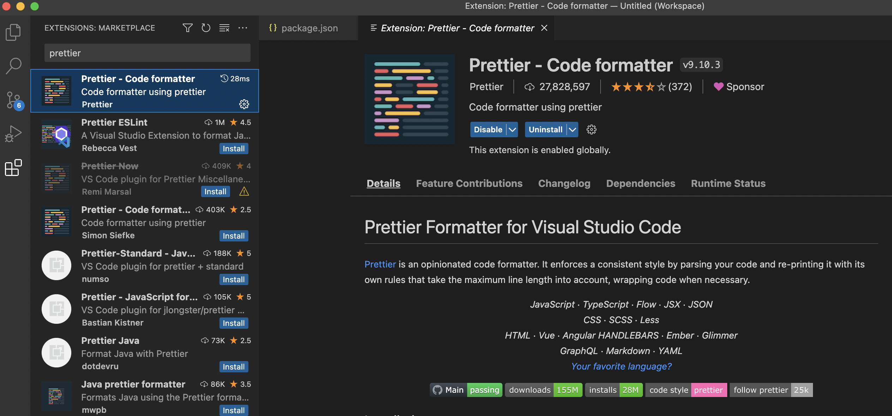
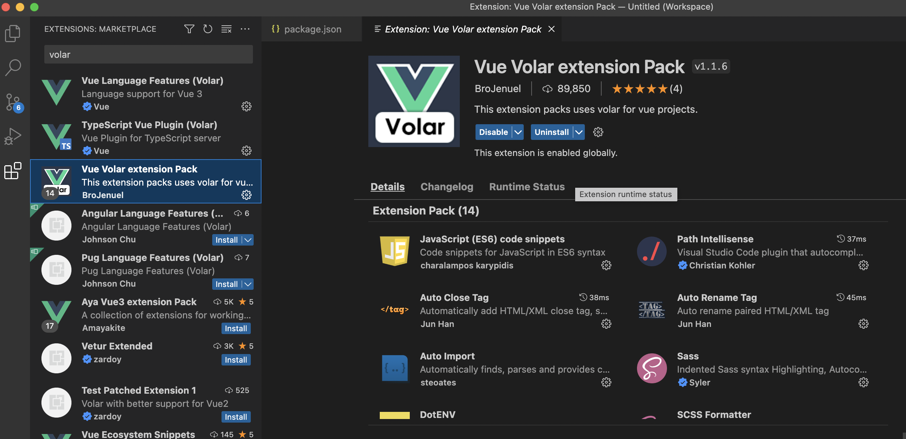

# Overview

The frontend is written in [vue3](https://vuejs.org) composition api in typescript, building with [Vite](https://vitejs.dev). Using the [BC Parks Bootstrap theme](https://digitalspace.github.io/bcparks-bootstrap-theme/). The theme still need to be discussed with UX designers.

## **Setup local development**

- Create a .env file inside this frontend folder with the following options:

  ```
  VITE_BACKEND_URL=http://localhost:3000

  // to enable the keycloak authentication, add the following:
  VITE_KEYCLOAK_URL=https://dev.loginproxy.gov.bc.ca/auth
  VITE_KEYCLOAK_CLIENT_ID=[keycloak client name]

  // to disable the keycloak authentication, add this:
  VITE_NODE_ENV=openshift-dev
  ```

- Install all requirement packages: `npm install`
- Start the application: `npm start`
- Run test: `npm test`

## **Setup visual studio code**

### **Install extensions**:

Prettier Formatter:
[](public/docs/vscode-extension-prettier.png)

Volar [as recommended](https://vuejs.org/guide/typescript/overview.html#ide-support):
[](public/docs/vscode-extension-volar.png)

### **Set indent and save on file**:

- Press "cmd+shift+p" and type "Preferences: Open Settings (UI)", select it
- In the open window, update the "Editor: Tab Size" to 2; search "format on save" and check the checkbox

### **Enable prettier format**:

Press "option+shift+f" and select prettier as the formatter

## **Technology options**

### **Style**:

[Bootstrap for vue3]([https://cdmoro.github.io/bootstrap-vue-3/components/Button.html](https://www.npmjs.com/package/bootstrap-vue-3)), installed through this [prefered installation method](https://cdmoro.github.io/bootstrap-vue-3/getting-started/#preferred-installation), so it can automatically importing components, to aviod the warn message that cannot find components when run unit tests

[Bootstrap icon for vue3](https://github.com/tommyip/bootstrap-icons-vue) doesn't work well with the bootstrap-vue-3 after installed bootstrap-vue-3 using the preferred method, so use [unplugin-icons for bootstrap](https://github.com/antfu/unplugin-icons) for now, until bootstrap-vue-3 adds all the icons. The problem of bootstrap-icons-vue library is that that its naming convention uses b-icon as prefix, so bootstrap-vue-3 will think it belongs to it, and then complains cannot found

### **Unit Test**:

[Vitest](https://vitest.dev/api/)  
[Vue test util](https://test-utils.vuejs.org/api/)

### **Reusable Form Component Structure**:

#### **FormData in a json format**:

```
{
  "container_id": {
    "model_name": "value",
    "model_name": [{
      "model_name": "value",
      ...
    }],
    ...
  },
  ...
}
```

where **container_id** is whatever we'd like to use for each form section, **model_name** is for the form content in this section, for example: input, select, radio, checkbox, table, etc. **model_name** is for the fields inside a table or a group

#### **Form json schema**:

```
{
  container: {
    title: string;
    id: string;
    defaultOpen?: boolean;
    nextId?: string;
    nextText?: string;
    alwaysOpen?: boolean;
  },
  content: [{
    fieldProps: {
        label: string;
        required?: boolean;
        id: string; 
        modelName: string; // It is required and need to be aligned with the field name in formData
        note?: string;
        tooltip?: string;
        errorMsg?: string;
    };
    type: string;
    disabled?: boolean;
    state?: boolean;
    depend?: {
      fieldModelName: string;
      value: string | number | boolean;
    };
    options?: Array<CommonObjectType>; // for select, checkbox group, radio group
    addButtonText?: string; // for table
    subfields?: Array<CommonObjectType>; // for table and group
  },
  ...
  ]
}
```

where the:  
**container** part has the properties for each form section, using the properties from the CollapseCard component, id need to be aliged with the one in formData
**content** part has the properties for each field in this form section

### **Vite vs vue cli**

The most recent recommended way to [create a vue app](https://vuejs.org/guide/quick-start.html#with-build-tools) is using the vite, vue cli could also [create typescript app](https://vuejs.org/guide/typescript/overview.html), but some [recent note](https://vuejs.org/guide/typescript/overview.html#note-on-vue-cli-and-ts-loader) recommends to migrate over to vite.  
The Vue CLI is built on top of webpack, it is a module bundler that will bundle your entire Vue project on startup, hot reloads, and compilation. Vue Vite instead offers faster startup, hot reload, and compilation speeds than bundler-based solutions during development.

## **Reference reading**

[vue3 composition api learning](https://vuejs.org/tutorial/#step-12)  
[vue3 computed properties](https://vuejs.org/guide/essentials/computed.html)  
[vue3 typescript with composition api](https://vuejs.org/guide/typescript/composition-api.html)  
[Testing frameworks for vue](https://vuejs.org/guide/scaling-up/testing.html#unit-testing)
