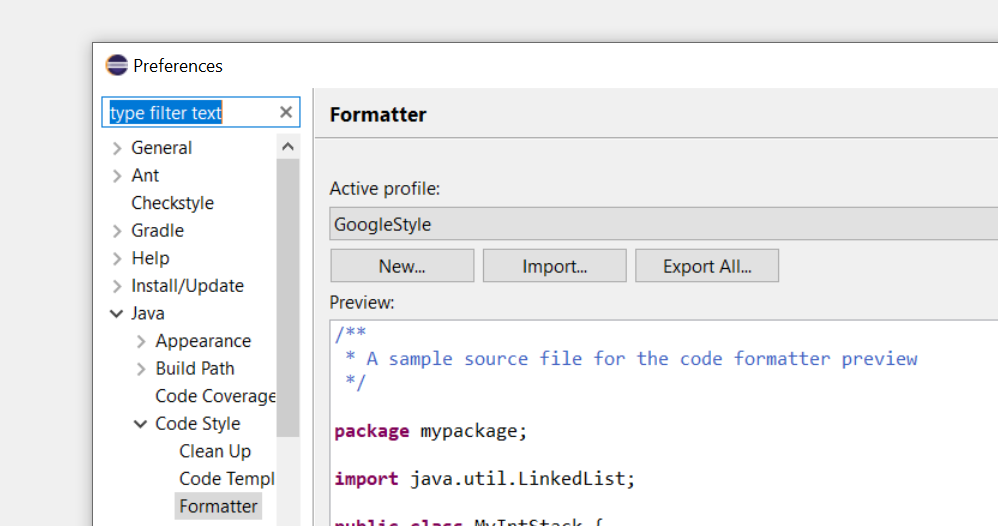

The nr-forest-client processor provides the automation mechanism to process submissions and do checks to allow for auto-approve and other validations

## Setup local development


    For a better developer experience, use IntelliJ IDEA and configure google style as the default style.

In order to run the application, you will need an instance of postgres running, it can be local, 
can be docker or even a remote server. Just make sure you have access to the server.


Each developer can have its own set of parameters for testing and development. For this, create a file inside the 
[config folder](config) with the name **application-dev-< YOUR NAME >.yml** or 
**application-dev-< YOUR NAME >.properties** and replace the **< YOUR NAME >** with your username, 
machine name or something unique that identifies you, for example **application-dev-jsmith.yml**.

We recommend **yml** files as they tend to be less repetitive, but it's up to you which file to use. 

Also, make sure to run the application using your profile, if it's through command line, remember to pass a 
**--spring.profiles.active=dev-jsmith** argument, or if using IntelliJ, create a run configuration (more on that later).

## Configuring your yml/properties file

When creating your own configuration file, you can overwrite any of the entries contained on the main 
[configuration file](src/main/resources/application.yml) as you wish, but the most optimal way of using it is by 
setting just the parameters inside the `ca.bc.gov.nrs` context, as the rest of the parameters are already defined.

Some parameters also have a link to an environment variable, that's usually used to replace 
its value during deployment.

Below is an example of the yml configuration and some comments on it:

```yml
ca:
  bc:
    gov:
      nrs:
        processor:
          # The time between each database check, uses duration format
          poolTime: 5M
        # Oracle database information
        oracle:
          service: ${ORACLEDB_SERVICENAME:fsa-forest}
          database: ${ORACLEDB_DATABASE:fsa-forest}
          host: ${ORACLEDB_HOST:localhost}
          port: ${ORACLEDB_PORT:1521}
          username: ${ORACLEDB_USER:user}
          password: ${ORACLEDB_PASSWORD:passwd}
          keystore: ${ORACLEDB_KEYSTORE:jssecacerts.jks}
          secret: ${ORACLEDB_SECRET:changeit}
        # Postgres database information
        postgres:
          database: ${POSTGRESQL_DATABASE:fsa-forest}
          host: ${POSTGRESQL_HOST:localhost}:5432
          username: ${POSTGRESQL_USER:user}
          password: ${POSTGRESQL_PASSWORD:passwd}
          url: r2dbc:postgresql://${ca.bc.gov.nrs.postgres.host}/${ca.bc.gov.nrs.postgres.database}

```

Also, as a properties file for reference:

```properties
# The time between each database check, uses duration format
ca.bc.gov.nrs.processor.poolTime=5M

# Oracle database information
ca.bc.gov.nrs.oracle.service=${ORACLEDB_SERVICENAME:fsa-forest}
ca.bc.gov.nrs.oracle.database=${ORACLEDB_DATABASE:fsa-forest}
ca.bc.gov.nrs.oracle.host=${ORACLEDB_HOST:localhost}
ca.bc.gov.nrs.oracle.port=${ORACLEDB_PORT:1521}
ca.bc.gov.nrs.oracle.username=${ORACLEDB_USER:user}
ca.bc.gov.nrs.oracle.password=${ORACLEDB_PASSWORD:passwd}
ca.bc.gov.nrs.oracle.keystore=${ORACLEDB_KEYSTORE:jssecacerts.jks}
ca.bc.gov.nrs.oracle.secret=${ORACLEDB_SECRET:changeit}

# Postgres database information
ca.bc.gov.nrs.postgres.database=${POSTGRESQL_DATABASE:fsa-forest}
ca.bc.gov.nrs.postgres.host=${POSTGRESQL_HOST:localhost}:5432
ca.bc.gov.nrs.postgres.username=${POSTGRESQL_USER:user}
ca.bc.gov.nrs.postgres.password=${POSTGRESQL_PASSWORD:passwd}
ca.bc.gov.nrs.postgres.url=r2dbc:postgresql://${ca.bc.gov.nrs.postgres.host}/${ca.bc.gov.nrs.postgres.database}
```

## Configuring IntelliJ Code Style

You will find a copy of the [google code style](docs/google_checks.xml) inside our [docs](docs) folder.

On the settings screen, add the checks as the following image:

[](docs/intellij-code-style.png)


## Configuring IntelliJ Run Configuration

To set your profile on IntelliJ, just run the 
[application main class](src/main/java/ca/bc/gov/app/BootApplication.java) 
and edit the configuration as the following image.

[](docs/intellij-run-config.png)

## Configuring Eclipse Code Style

You will find a copy of the [google code style](docs/eclipse-java-google-style.xml) inside our [docs](docs) folder.

On the window > preferences screen, go to Java > Code Style > Formatter, 
import the xml file and keep **GoogleStyle** selected as the following image:

[](docs/eclipse-code-style.png)


## Configuring Eclipse Run Configuration

To set your profile on Eclipse, just run the
[application main class](src/main/java/ca/bc/gov/app/BootApplication.java)
and edit the configuration as the following images.

[](docs/eclipse-run-config1.png)

[](docs/eclipse-run-config2.png)


## Setting up Lombok on Eclipse

If you're running eclipse, you will need to manually install lombok in order for it to work. 
The easiest way of doing that is by running any mavem command that would trigger the download of the lib, such as
`mvn clean compile`.

Once it's done, navigate to your repository folder (its usually inside your user folder, called *.m2/repository*) 
and look the latest version of lombok (inside org/projectlombok/lombok/) and run the lombok jar, 
like `java -jar lombok-X.Y.Z.jar`.

[](docs/eclipse-lombok.png)

A screen will pop up, listing all the possible IDEs, select yours and install/update it. Once it's done, 
restart eclipse.